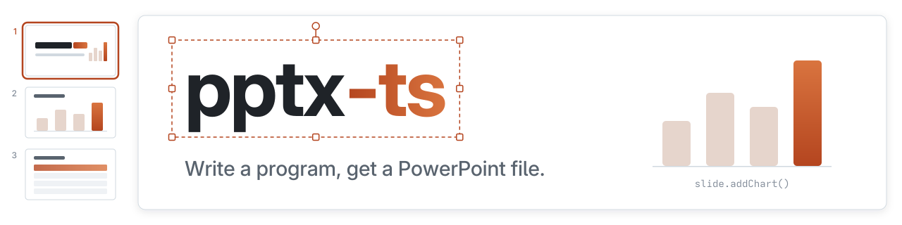
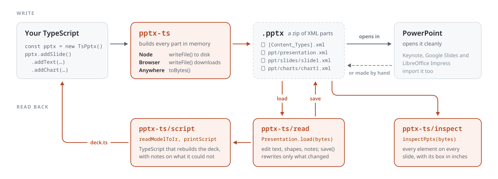

<div align="center">

<picture>
  <source media="(prefers-color-scheme: dark)" srcset="assets/readme/banner/banner-dark.svg">
  
</picture>

[![npm][npm-badge]][npm]
[![Downloads][downloads-badge]][npm]
[![CI][ci-badge]][ci]
[![License][license-badge]][license]

---

[Install](#install) • [Quickstart](#quickstart) • [Read and edit](#read-and-edit-decks-too) • [Compare](#how-this-compares-with-pptxgenjs) • [Docs](https://shbernal.github.io/pptx-ts/)

---

</div>

<p align="center">
<picture>
  <source media="(prefers-color-scheme: dark)" srcset="assets/readme/demo/demo-dark.svg">
  
</picture>
</p>

pptx-ts writes `.pptx` files from TypeScript.
You describe slides in code, and a deck comes out that opens cleanly in desktop PowerPoint.
PowerPoint never runs, so there is no Office licence and nothing to install on the machine doing the writing.

- Text, tables that page across slides, shapes, connectors, pictures, SVG, video and audio.
- Native charts backed by an embedded workbook, so PowerPoint's "Edit Data" works.
- Slide masters, layouts, sections, speaker notes, gradients and an image clipped to a shape.
- LaTeX maths, embedded spreadsheets and 3D models.
- [An HTML `<table>` becomes paged slides](docs/html-tables.md), in the browser or under Node.
- [Text measured against the real font](docs/text-fit.md), so a box shrinks or grows to fit before the file is written.
- Opens existing decks too: [inspect](docs/reference/pptx-inspection.md), [edit](docs/reading/read-and-edit.md), or [turn one into code](docs/reference/pptx-to-script.md).

<p align="center">
  
</p>

pptx-ts wrote every slide above, and LibreOffice rendered them.
They come from the two [showcase decks](www/demos/decks/README.md).

## Why pptx-ts?

Use it when a deck has to be built from data that changes:

- a monthly report
- one deck per customer
- a hundred decks every night
- a download button that hands the user a deck built from what they are looking at

Every deck has to open cleanly in desktop PowerPoint.
Keynote, LibreOffice Impress and Google Slides import it on a best-effort basis.

## Quickstart

1. Install pptx-ts on your project:

   [![Node ≥ 24][node-badge]][node]

   ```bash
   pnpm add pptx-ts
   ```

2. Save this as `hello.mts`:

   ```ts
   import TsPptx from "pptx-ts"

   const pptx = new TsPptx()
   const slide = pptx.addSlide()

   slide.addText("Hello from pptx-ts", {
     x: 1,
     y: 1,
     w: 8,
     h: 1,
     fontSize: 24,
     color: "363636",
   })

   await pptx.writeFile({ fileName: "hello.pptx" })
   ```

2. Run it. Node 24 strips the types itself, so there is no build step.

   ```bash
   node hello.mts
   ```

3. Open `hello.pptx`.

Positions are in inches, from the top-left corner of a 10 by 5.625 inch slide.
[Your first deck](docs/getting-started/first-deck.md) builds a four-slide report from an array, with a table, a chart and speaker notes.

## Read and edit decks too

PptxGenJS, the library pptx-ts descends from, only writes.
pptx-ts also opens a `.pptx` you already have.

| Entry point | What it does |
| --- | --- |
| `pptx-ts/inspect` | Slide count, size, parts, media and fonts, without loading the whole deck. [Guide](docs/reference/pptx-inspection.md) |
| `pptx-ts/read` | Open a deck, change the text on slide four, save it. Parts you did not touch keep their original bytes. [Guide](docs/reading/read-and-edit.md) |
| `pptx-ts/script` | Print TypeScript that rebuilds a deck, plus a note for each construct it could not carry. [Guide](docs/reference/pptx-to-script.md) |

```ts
import { readFile, writeFile } from "node:fs/promises"
import { Presentation } from "pptx-ts/read"

const deck = await Presentation.load(await readFile("report.pptx"))
const title = deck.slides[0]?.placeholder("title")
if (title) title.text = "Q3 review"

await writeFile("report.pptx", await deck.save())
```

The script printer is the quickest way to learn the API.
Build a slide by hand in PowerPoint, then read the code for it.

## How it works

<p align="center">
<picture>
  <source media="(prefers-color-scheme: dark)" srcset="assets/readme/how-it-works/loop-dark.svg">
  
</picture>
</p>

A `.pptx` is a zip of XML parts.
pptx-ts builds those parts from your calls and zips them, with no Office process involved.

| Runtime | Import | `writeFile` |
| --- | --- | --- |
| Node.js 24 or later | `import`, or `require()` with the class on `.default` | writes to disk |
| Browser, with a bundler | `import` | downloads the file |
| Browser, no build step | `import TsPptx from "https://esm.sh/pptx-ts/browser"` | downloads the file |
| Deno, Bun, edge workers | `import` | throws; use `toBytes()` |

[Where it runs](docs/getting-started/runtime.md) lists every entry point.

<!-- comparison:start -->
<!-- GENERATED REGION. Do not edit by hand.
     Regenerate with `pnpm run comparison:render`.
     Source: `scripts/comparison/snapshot.json`, written by `scripts/comparison/measure.mjs`. -->

## How this compares with PptxGenJS

pptx-ts is an independent derivative of
[PptxGenJS](https://github.com/gitbrent/PptxGenJS), detached at its v4.0.1. Both were
measured on 2026-09-21 by building the same 22 deck intents with each library and reading
the bytes that came out.

- **Construct coverage:** pptx-ts emitted 21 of 22, pptxgenjs 10 of 22. Nothing in the
  corpus is emitted by pptxgenjs and not by pptx-ts.
- **Schema validity:** of the decks each library built, 21 of 21 pptx-ts decks and 0 of 10
  pptxgenjs decks validate with no error against the Open XML SDK.
- **Adoption:** pptxgenjs is downloaded 10,539,687 times a month, against 1,780 for
  pptx-ts. If a large installed base matters to you more than the differences above, use
  pptxgenjs.
- **Activity:** last commit on the default branch, 2026-09-15 for pptx-ts and 2025-06-26
  for pptxgenjs. Last npm publish, 2026-08-29 and 2025-06-26.

Where the two libraries part company is on the [comparison page](docs/comparison.md), and
[how it was measured](docs/comparison-method.md) has every full table. Every intent as
each library expresses it, including the calls that differ, is on [porting from
PptxGenJS](docs/comparison-syntax.md).

<!-- comparison:end -->

## Learn more

- [Documentation site](https://shbernal.github.io/pptx-ts/), with the API reference
- [Live demo](https://shbernal.github.io/pptx-ts/demos): build a quarterly review deck in your browser
- [Core concepts](docs/getting-started/concepts.md), [tables](docs/tables.md), [connectors](docs/connectors.md) and [groups](docs/groups.md)
- [Smaller browser bundles](docs/bundle-size.md)
- [Errors and warnings](docs/errors-and-warnings.md) and [troubleshooting](docs/troubleshooting.md)

Found a bug? [Open an issue](https://github.com/shbernal/pptx-ts/issues).
Errors that are the library's fault print that link themselves.

If an agent writes most of your code, install the `ts-pptx-upstream` skill that ships in the package.
It files a library defect the agent hits as an issue with a small reproduction, instead of a silent workaround.
[CONTRIBUTING.md](CONTRIBUTING.md#the-skill-that-files-the-issue-for-you) has the install command.


[npm]: https://www.npmjs.com/package/pptx-ts
[npm-badge]: https://img.shields.io/npm/v/pptx-ts?style=for-the-badge&logo=npm&logoColor=e9855c&label=npm&labelColor=1b1b1f&color=b4451f
[downloads-badge]: https://img.shields.io/npm/dm/pptx-ts?style=for-the-badge&label=downloads&labelColor=1b1b1f&color=b4451f
[ci]: https://github.com/shbernal/pptx-ts/actions/workflows/ci.yml
[ci-badge]: https://img.shields.io/github/actions/workflow/status/shbernal/pptx-ts/ci.yml?branch=main&style=for-the-badge&logo=githubactions&logoColor=e9855c&label=CI&labelColor=1b1b1f&color=b4451f
[node]: package.json
[node-badge]: https://img.shields.io/badge/node-%E2%89%A524-b4451f?style=for-the-badge&logo=nodedotjs&logoColor=e9855c&labelColor=1b1b1f
[license]: LICENSE
[license-badge]: https://img.shields.io/github/license/shbernal/pptx-ts?style=for-the-badge&labelColor=1b1b1f&color=b4451f
